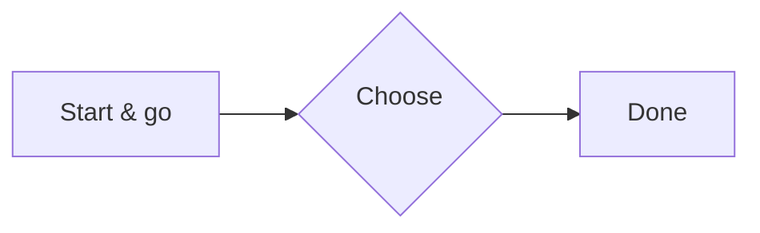

Synthetic body for the alpha post. It exists only to exercise ordering,
tags, and the home hero. See also the [beta post](/posts/beta/).

## Getting Started

First steps with the synthetic example.

### What's new?

Punctuation folds out of fragment anchors.

## Getting Started

A repeated heading earns a deterministic `-1` suffix.

## Über den Tellerrand

Unicode letters survive anchor folding.

### Using `code` and *emphasis*

Inline markup strips to plain text in anchors and the TOC.

## Field Notes in Code

```rust
fn greet(name: &str) -> String {
    // Special chars stay escaped: <div> & "quotes"
    format!("Hello, {name}!")
}
```

```python
def total(items):
    """Sum with <angle> brackets & ampersands."""
    return sum(items)
```

```
Plain fences render without language hooks.
```



> [!WARNING]
> Do not run untrusted snippets. Review **every** line before executing,
> especially piped `curl` installers.
>
> - Prefer pinned versions.
> - Check hashes where published.

> [!TIP]
> Keep functions small and write a [test](/posts/beta/) for each one.

